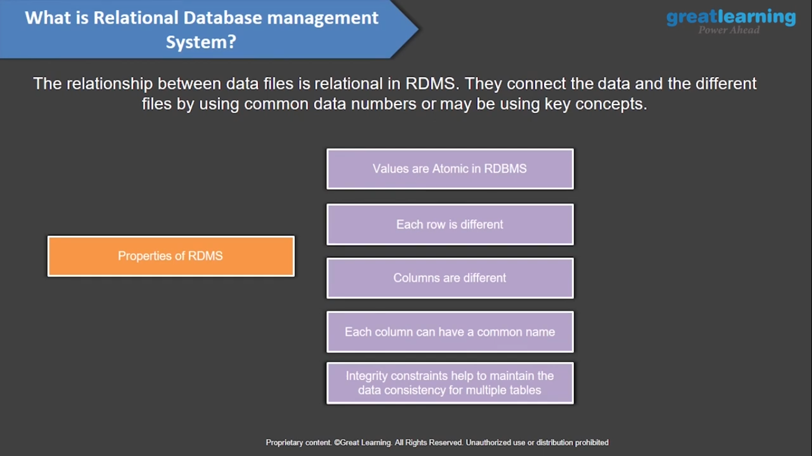
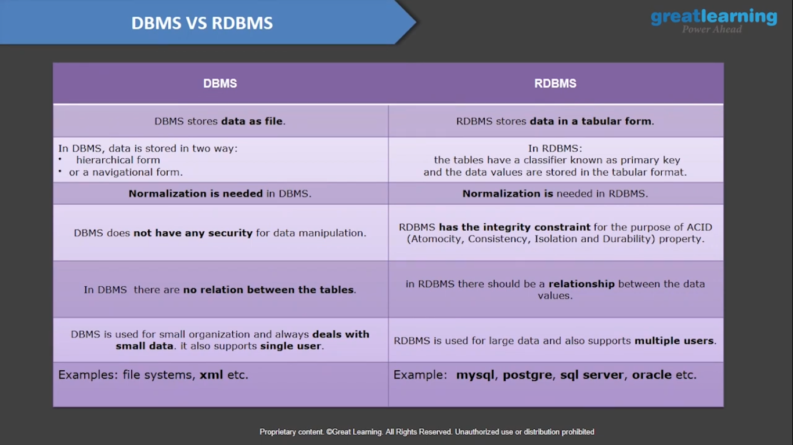
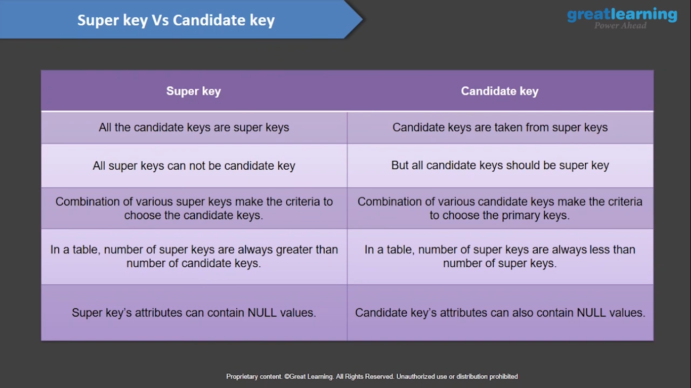
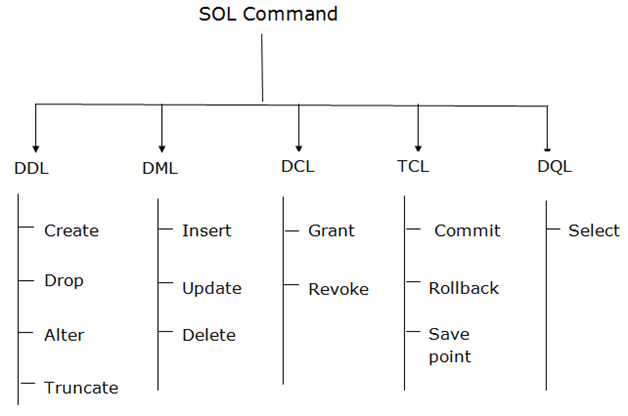

# Data Base Tutorial
### <span style="color: #1111dd">What is data ?</span>
    Data is a collection of a distinct small unit of information. It can be used in a variety of forms like text, numbers, media, bytes, etc. it can be stored in pieces of paper or electronic memory, etc.
## What is **Data Base** and  why we use this ?
    A database is an organized collection of data, so that it can be easily accessed and managed.
**Need Of Data Base**
1. Manages large amounts of data
1. Accurate
1. Easy to update data
1. Security of data
1. Data integrity
1. Easy to research data
#### Ex :-
1. Online Telephone Directory use a database to store there data Like: Name,Address,Phone number,other contact details
1. Online Labrary

## What is Database Management System ?
    A software where we can store ,retrive ,define and Manage our data in database.
# History Of DataBase
1. 1960 Charles Bachman designed first DBMS system 
1. 1976 Peter Chen coined and defined Entity relationship model also known as ER model
1. 1985 Object-oriented DBMS develops
1. 1991 Microsoft ships MS access , a personal DBMS and that displaces all other pesonal DBMS products
1. 1995 first internet database application 
1. 1997 XML applied to database processing.

## Most used Database Management System Software
- MySql
- Oracal
- PostgreSQL
- SQLite
- Maria DB
- NoSQL
# Type of DBMS (Model)
- Hierachical DataBases Management
- Network
- Relational Model
    - This model is worked on normalizing data in database.
    - Relational model store the data in fixed structure and manipulated them using SQL
- Object Oriented model
    - Data are stored in form of Object 
    - It maintains a Sturcture which is known as classes and display the data within that.
    - It also stores data members values and operations both.

## Relational DataBase

- What is different  b/w Data base and RDBMS



# Let's Dive into RDBMS 
### Key's 
     This is used for identifying the unique rows form table and also help to establish relationship among the tables
1. Primary key
1. super key
1. Candidate key
1. Alternate key
1. Composite key
1. Foregin key

## Primary key
    A primary key concept is basically a technique to classify unique tuples in a table
## Super Key
    A super key is set of one of more columns or attributes to uniquely classify rows in a table
## Candidate key
    A candidate key is a set of one columns or attributes to uniquely classify rows in a table
### Super key Vs Candidate key

## Alternate key
    Out of all candidate keys, only one gets selected for primary key and rest keys are known as lternate or secondary keys
## Composite key
    Composite key consists of greater than one attribute to uniquely classify rows or records & tuples in a table.

## Foreign keys 
    the columns of a table which refers to primary key of another table and basically they act a cross-reference b/w tables
# Normalization 
    Normalization is the process of organizing data to avoid duplication and redundancy
1. Helps to minimize duplicate data
1. To minimize or avoid data modification issues
1. To simplify queries

# ER Diagram
    An Entity-relationship model(ER model) help to describe the structure of a praticular database with help of a diagram, this is known as entiry relationship diagram 
# SQL 
 - SQL stands for Structured Query Language
 - SQL helps to access and manipulate your databases
 - SQL became a standard of American National Standards Institute(ANSI) in 1986, and of International Organization for Standardization(ISO) in 1987

 # SQL Type
 

 ## DDL (Data Definition Languag)
- DDL changes the structure of the table like creating a table, deleting a table, altering a table, etc.
- All the command of DDL are auto-committed that means it permanently save all the changes in the database.
### Let us Discuss about data types
- In MySQL there are three main data types: string, numeric, and date and time.
#### String Data Types
1. CHAR(size)
    	A FIXED length string (can contain letters, numbers, and special characters). The size parameter specifies the column length in characters - can be from 0 to 255. Default is 1
1. VARCHAR(size)
A VARIABLE length string (can contain letters, numbers, and special characters). The size parameter specifies the maximum column length in characters - can be from 0 to 65535
1. BINARY(size)
1. VARBINARY(size)
1. TINYBLOB
1. TINYTEXT
1. TEXT(size)
1. BLOB(size)
1. MEDIUMTEXT
1. MEDIUMBLOB
1. LONGTEXT
1. LONGBLOB
1. ENUM(val1, val2, val3, ...)
1. ENUM(val1, val2, val3, ...)
#### Numeric Data Types
 1. BIT(size)
 1. TINYINT(size)
 1. BOOL
 1. BOOLEAN
 1. SMALLINT(size)
 1. MEDIUMINT(size)
 1. INT(size) A medium integer. Signed range is from -2147483648 to 2147483647. Unsigned range is from 0 to 4294967295. The size parameter specifies the maximum display width (which is 255)
 1. INTEGER(size)
 1. BIGINT(size)
 1. FLOAT(size, d)
 1. FLOAT(p)
 1. DOUBLE(size, d)
 1. DOUBLE PRECISION(size, d)	
 1. DECIMAL(size, d)
 1. DEC(size, d)

 #### Date and Time Data Types
 1. DATE A date. Format: YYYY-MM-DD. The supported range is from '1000-01-01' to '9999-12-31'
 1. DATETIME(fsp) A date and time combination. Format: YYYY-MM-DD hh:mm:ss. The supported range is from '1000-01-01 00:00:00' to '9999-12-31 23:59:59'. Adding DEFAULT and ON UPDATE in the column definition to get automatic initialization and updating to the current date and time
 1. TIMESTAMP(fsp)
 1. TIME(fsp)
 ### Create

```SQL
 CREATE TABLE TABLE_NAME (COLUMN_NAME DATATYPES[,....]);
 ```

 ### Drop
 - It is used to delete both the structure and record stored in the table
 ```SQL
 DROP TABLE table_name
 ```
 ### Alter
 - It is used to alter the structure of the database. This change could be either to modify the characteristics of an existing attribute or probably to add a new attribute
 ```SQL
 #To add a new column in the table
 ALTER TABLE table_name ADD column_name COLUMN-definition;    

 #To modify existing column in the table
 ALTER TABLE table_name MODIFY(column_definitions....);  
 ```
 ### Truncate
 - It is used to delete all the rows from the table and free the space containing the table
 ## DML
 ### INSERT
 - The INSERT statement is a SQL query. It is used to insert data into the row of a table
 ```SQL
 INSERT INTO TABLE_NAME    
(col1, col2, col3,.... col N)  
VALUES (value1, value2, value3, .... valueN);  
 ```
 ### UPDATE
 - This command is used to update or modify the value of a column in the table
 ```SQL
 UPDATE table_name SET [column_name1= value1,...column_nameN = valueN] [WHERE CONDITION]   

 ```
 ### DELETE
 - It is used to remove one or more row from a table
 ```SQL
 DELETE FROM table_name [WHERE condition];  
 ```
 ## DCL
 - DCL commands are used to grant and take back authority from any database user
 
 ### Grant
- It is used to give user access privileges to a database
```SQL
GRANT SELECT, UPDATE ON MY_TABLE TO SOME_USER, ANOTHER_USER
```
 ### Revoke
 - REVOKE SELECT, UPDATE ON MY_TABLE FROM USER1, USER2
```SQL
REVOKE SELECT, UPDATE ON MY_TABLE FROM USER1, USER2;  

```
 ## TCL(Transaction Control Language)
- TCL commands can only use with DML commands like INSERT, DELETE and UPDATE only.

- These operations are automatically committed in the database that's why they cannot be used while creating tables or dropping them.

 ### COMMIT
 - Commit command is used to save all the transactions to the database
 ```SQL
DELETE FROM CUSTOMERS  
WHERE AGE = 25;  
COMMIT;  
```
 ### ROLLBACK
 - Rollback command is used to undo transactions that have not already been saved to the database.
 ```SQL
DELETE FROM CUSTOMERS  
WHERE AGE = 25;  
ROLLBACK
```
 ### SAVEPOINT 
 - It is used to roll the transaction back to a certain point without rolling back the entire transaction.
 ```SQL 
 SAVEPOINT SAVEPOINT_NAME;
 ```
 ## DQL
 ### SELECT
 - This is the same as the projection operation of relational algebra. It is used to select the attribute based on the condition described by WHERE clause

 ```SQL
SELECT expressions    
FROM TABLES    
WHERE conditions;  
 ```
 ```SQL
=	Equal	
>	Greater than	
<	Less than	
>=	Greater than or equal	
<=	Less than or equal	
<>	Not equal. Note: In some versions of SQL this operator may be written as !=	
BETWEEN	Between a certain range	
LIKE	Search for a pattern	
IN	To specify multiple possible values for a column
 ```
